# Ambientação: Preparando o laboratório

Este capítulo é apenas um alinhamento preparatório do laboratório do conteúdo apresentado neste material, e segue os seguintes objetivos:

- Instalar e configurar o VirtualBox
- Instalar o Git
- Instalar o Vagrant
- Obter os arquivos do curso

## VirtualBox

O Oracle VM VirtualBox [1] é um aplicativo de virtualização multiplataforma. Possui compatibilidade com computadores baseados em Intel ou AMD, estejam eles executando sistemas operacionais (SOs) Windows, Mac OS X, Linux ou Oracle Solaris. O VirtualBox consegue estender os recursos do seu computador existente para que ele possa executar vários sistemas operacionais, dentro de várias máquinas virtuais, ao mesmo tempo. Como exemplo, você pode executar Windows e Linux em seu Mac, executar o Windows Server 2016 em seu servidor Linux, executar Linux em seu PC com Windows e assim por diante, tudo junto com seus aplicativos existentes. Você pode instalar e executar quantas máquinas virtuais desejar. Os únicos limites práticos são espaço em disco e memória.

Precisamos do **VirtualBox** em nossa infraestrutura para gerenciar as máquinas virtuais que serão utilizadas neste material.

> Saiba mais: [https://www.virtualbox.org/manual/ch01.html](https://www.virtualbox.org/manual/ch01.html)

## Laboratório:  Instalar e configurar o VirtualBox


Neste laboratório vamos aprender como instalar e configurar o VirtualBox nos sistemas operacionais Windows, Linux e Mac.

### Sistema operacional Windows

Para começar, acesse o site do VirtualBox, clique em [Downloads](https://www.virtualbox.org/wiki/Downloads) e clique na opção **Windows hosts**:

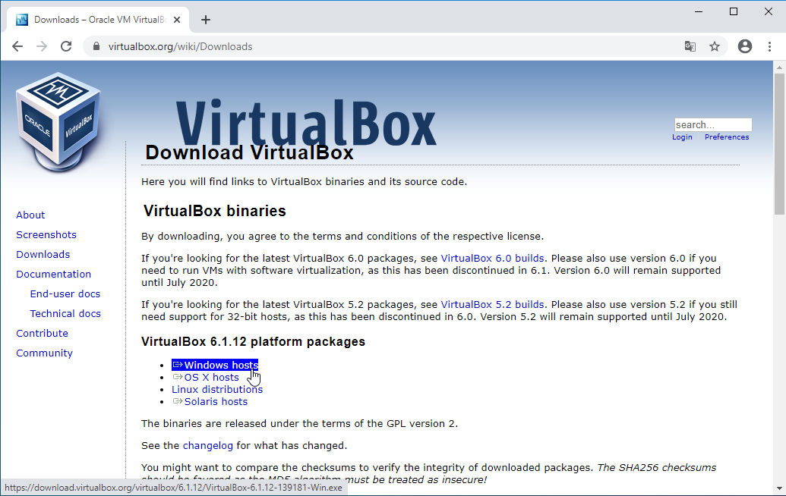

Clique duas vezes no arquivo executável do instalador e siga as instruções de instalação:

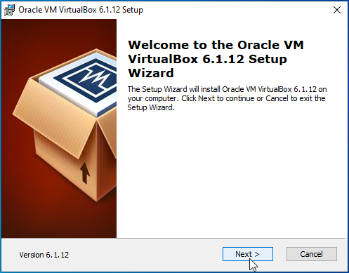

Após realizar a instalação, clique no botão **Finish**:

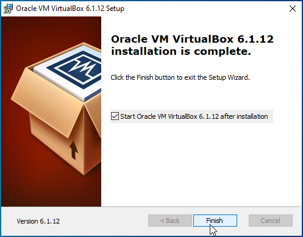

Verifique se o VirtualBox foi instalado corretamente em seu sistema:

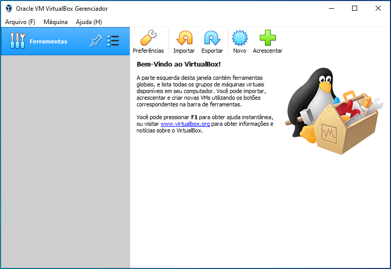

### Sistema operacional Linux

Para começar acesse o site do VirtualBox, clique em Downloads e clique na opção **Linux distributions**:

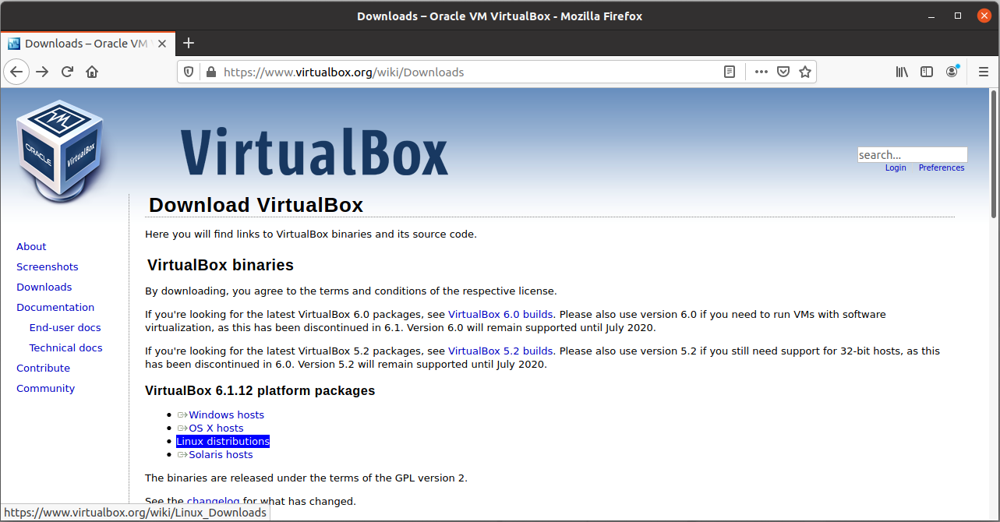

Selecione a sua distribuição para realizar o download do pacote de instalação. No exemplo apresentado, será feito o download para a distribuição **Ubuntu**:

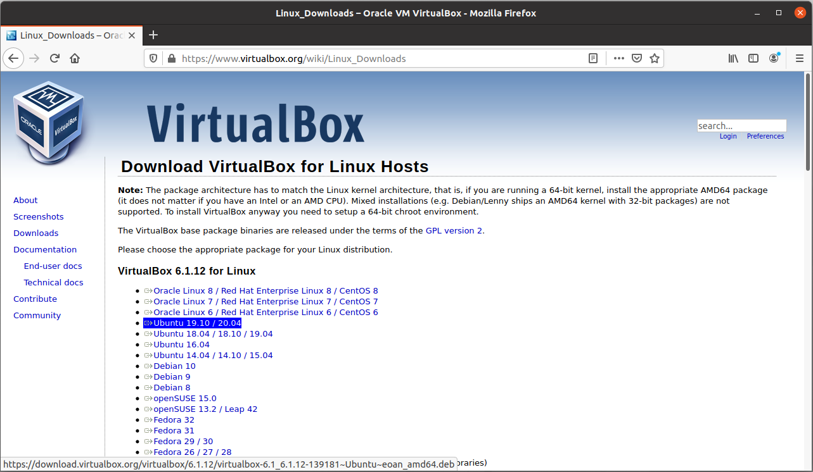

Selecione a opção para salvar o arquivo:

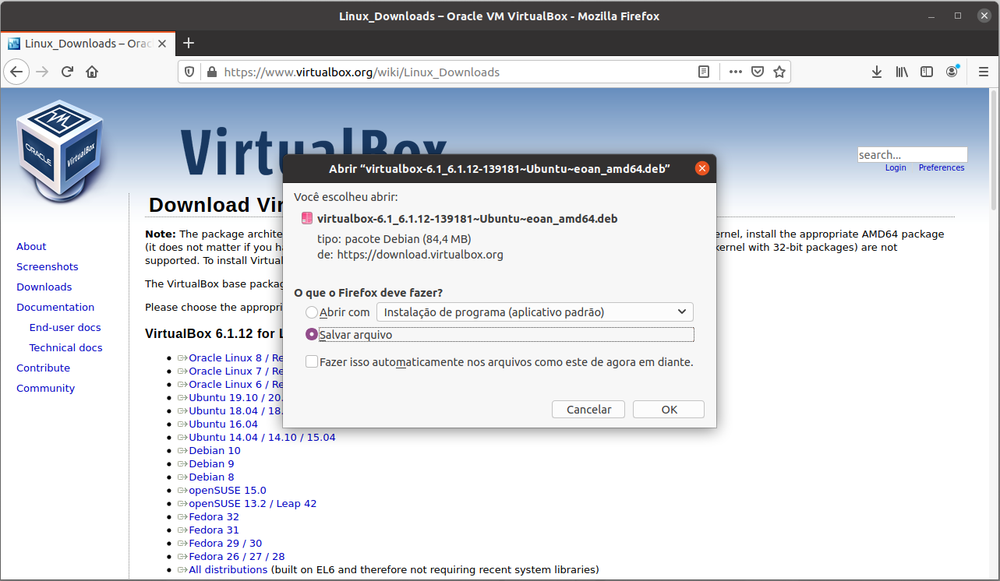

Acesse a pasta onde o pacote de instalação do VirtualBox foi armazenado e realize a instalação conforme a sua distribuição. Exemplos:

**Debian/Ubuntu**

```bash
sudo dpkg -i $HOME/Downloads/virtualbox-<versão>.deb
sudo apt install -f
```

**Oracle Linux/openSUSE/Fedora**

```bash
sudo rpm -i $HOME/Downloads/virtualbox-<versão>.rpm
```

Verifique se o VirtualBox foi instalado corretamente em seu sistema:

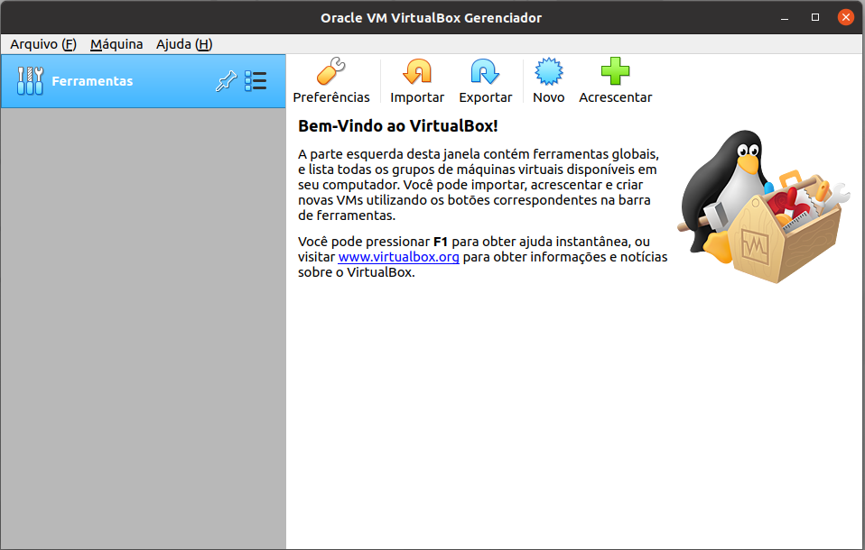

### Sistema operacional Mac OS X

Para começar acesse o site do VirtualBox, clique em [Downloads](https://www.virtualbox.org/wiki/Downloads) e clique na opção **OS X hosts**:

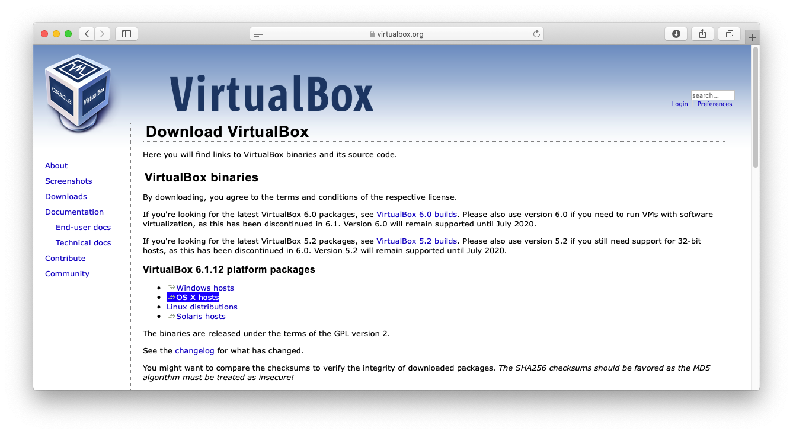

Clique duas vezes no arquivo **DMG** para montar o disco de instalação do VirtualBox:

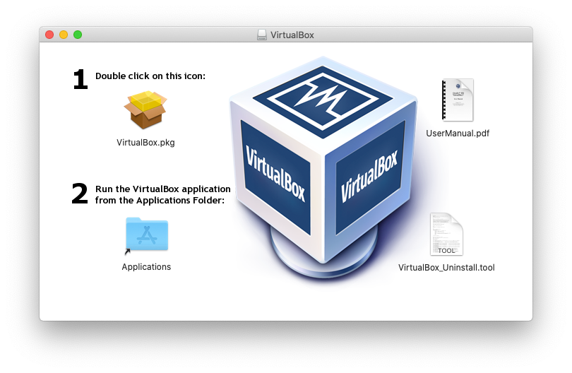

Feito isso, clique duas vezes no arquivo **VirtualBox.pkg** e siga as instruções de instalação:

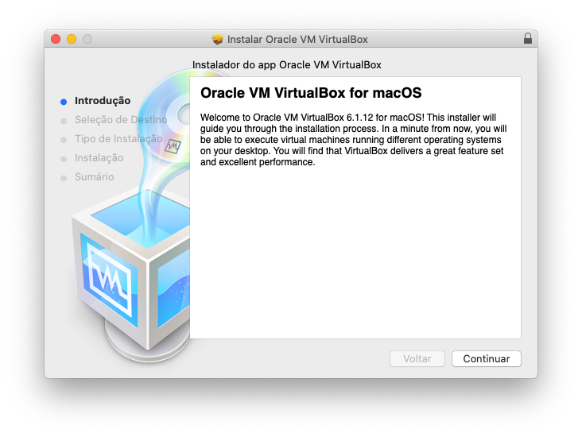

Após realizar a instalação clique no botão **Fechar**:

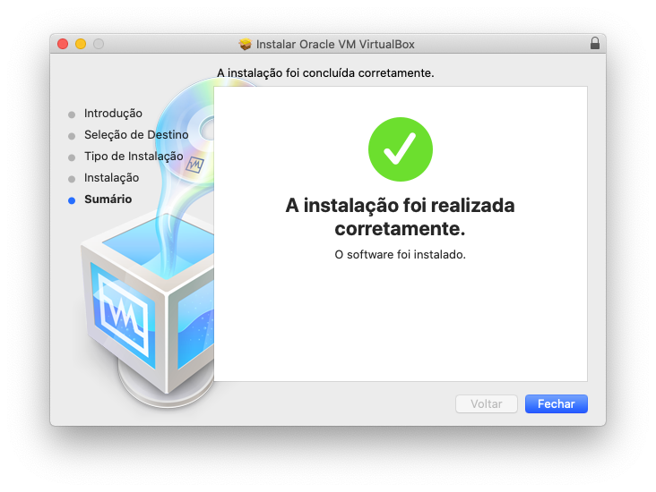

Verifique se o VirtualBox foi instalado corretamente em seu sistema:

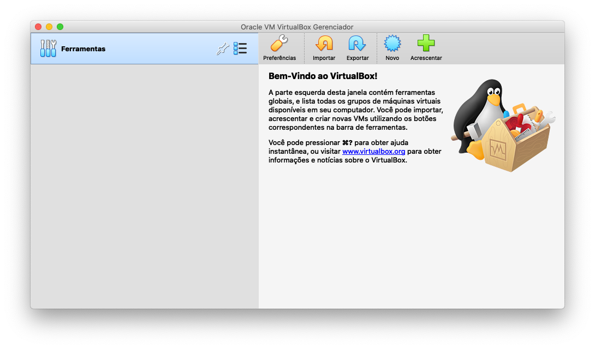

### Configuração do VirtualBox Extension Pack em Windows/Linux/Mac

Para começar, acesse o site do VirtualBox e na área de [Downloads](https://www.virtualbox.org/wiki/Downloads) clique em **All supported platforms** para realizar o download do **Extension Pack**:

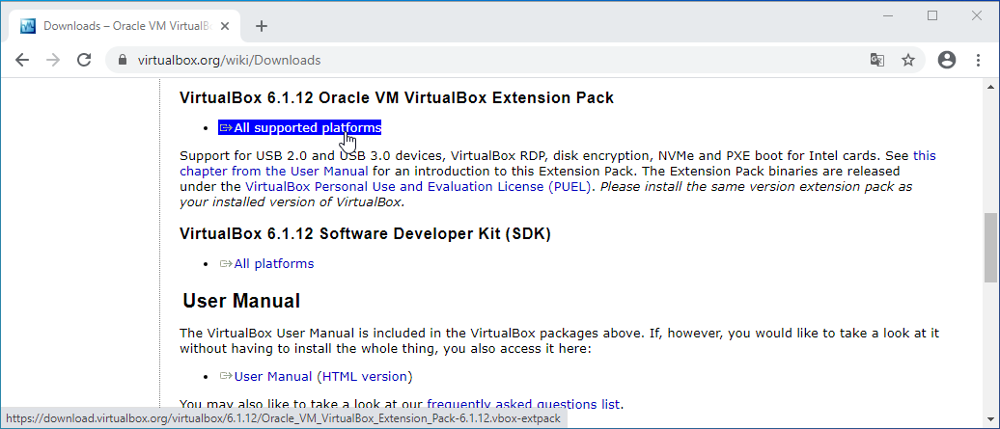

Clique duas vezes no arquivo `Oracle_VM_VirtualBox_Extension_Pack-<versão>.vbox-extpack` para iniciar a instalação do pacote. Na janela do VirtualBox clique no botão **Instalar**:

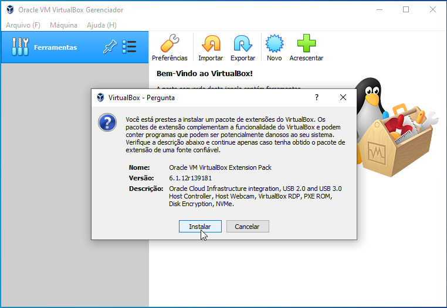

Clique no botão **Eu concordo (A)** para aceitar a licença de uso:

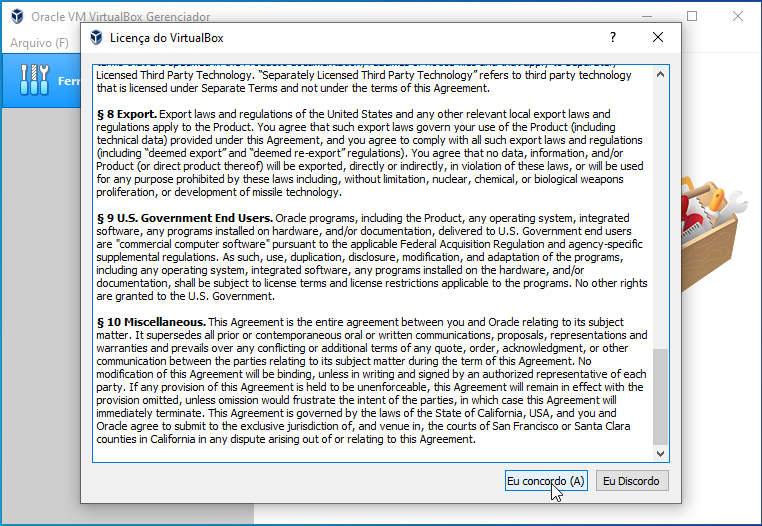

Confirme a instalação do Extension Pack e clique no botão **OK**.

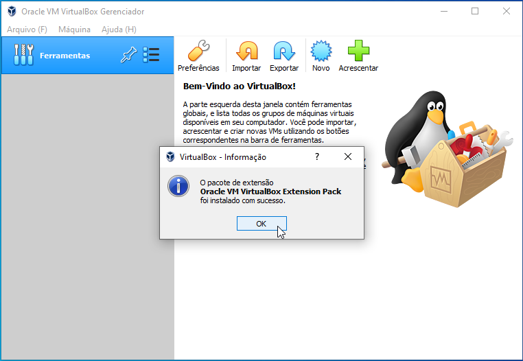

## Git

O Git [2] é software utilizado para gerenciar controle de versão, distribuído através de repositórios públicos e privados. Precisamos do **Git** em nossa infraestrutura para obter os arquivos do curso que estão no repositório Github da 4Linux em https://github.com/4linux.

## Laboratório: Instalar o Git


Neste laboratório vamos aprender como instalar o Git nos sistemas operacionais Windows, Linux e Mac.

### Sistema operacional Windows

Antes de iniciar a instalação do **Git** no Windows, vamos utilizar também a ferramenta Cygwin [3]. Essa ferramenta disponibiliza uma coleção de ferramentas Open Source que fornecem funcionalidades semelhantes a uma distribuição Linux no Windows.

> Alternativas ao Cywin para instalação do Git:
>  - **Git**: [https://git-scm.com/download/win](https://git-scm.com/download/win)
>  - **Git Bash**: [https://gitforwindows.org](https://gitforwindows.org)

Para começar acesse o site do Cygwin, clique em **Install Cygwin** e então clique no link **setup-x86_64.exe**:

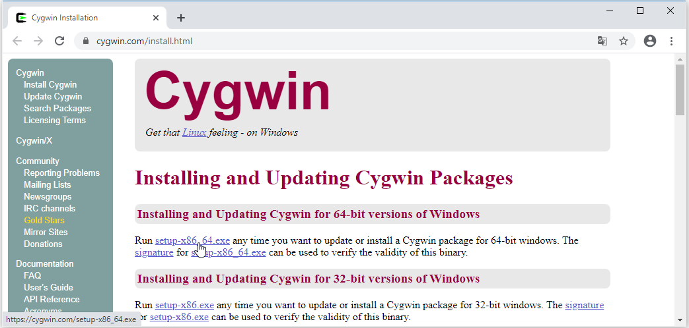

Abra o arquivo executável do instalador e clique no botão **Avançar** para iniciar a instalação:

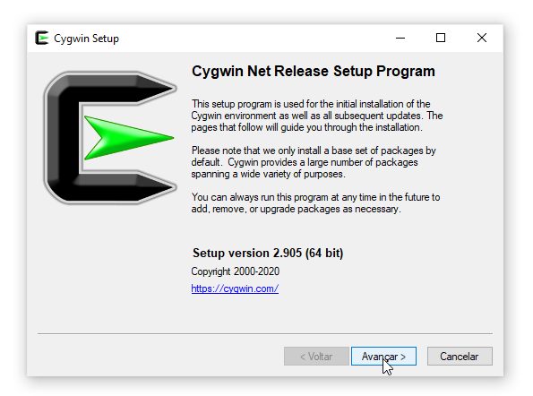

Selecione a opção onde informa que os pacotes serão baixados da Internet, através da opção **Install from Internet**. Clique no botão **Avançar** para continuar a instalação:

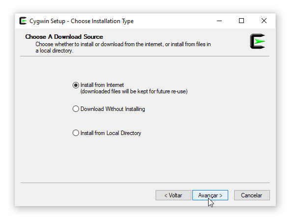

Confirme o diretório em que o Cygwin será instalado. Clique no botão **Avançar** para continuar a instalação:

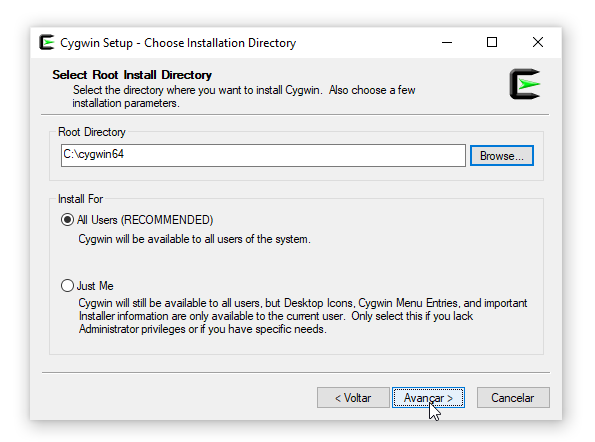

Confirme o diretório que o Cygwin irá armazenar os arquivos de pacotes e configurações. Clique no botão **Avançar** para continuar a instalação:

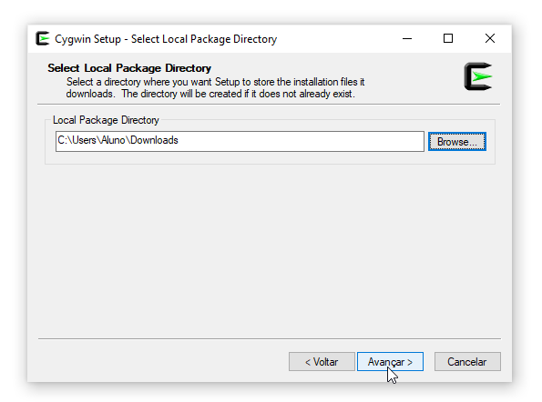

Selecione o tipo de conexão com a internet, através da opção **Direct Connection**. Clique no botão **Avançar** para continuar a instalação:

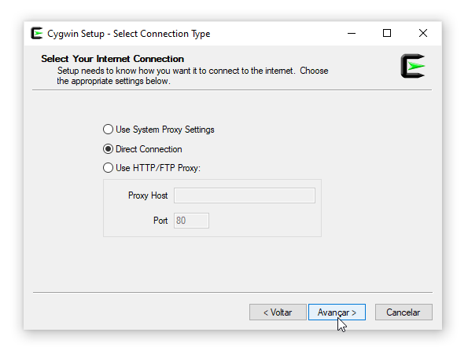

Selecione a URL do site onde o Cygwin irá baixar os pacotes, através da lista **Available Download Sites**. Clique no botão **Avançar** para continuar a instalação:

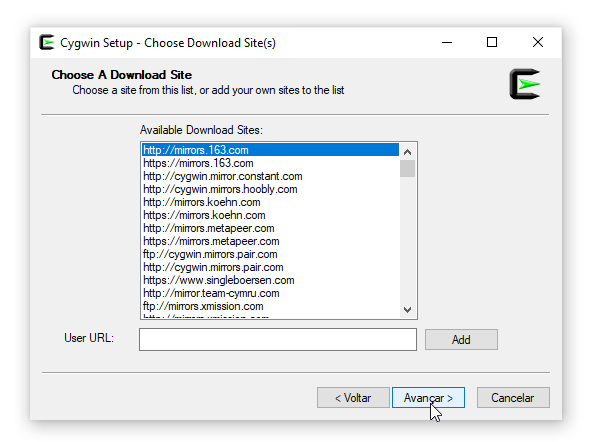

Para selecionar o pacote **git**:

- Na caixa **View**, selecione a opção **Full**;
- Na caixa **Search**, digite **git**;
- Na coluna **New**, selecione a versão do **git**;
- Na coluna **Src**, selecione **git**;
- Clique no botão **Avançar** para continuar a instalação:

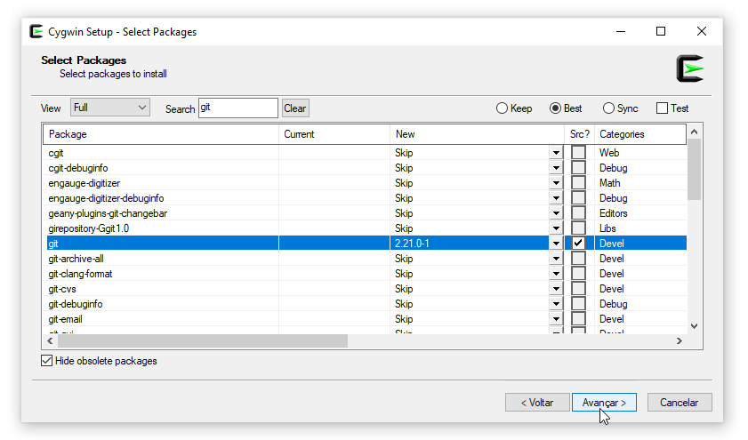

Confirme os pacotes através do botão **Avançar**:

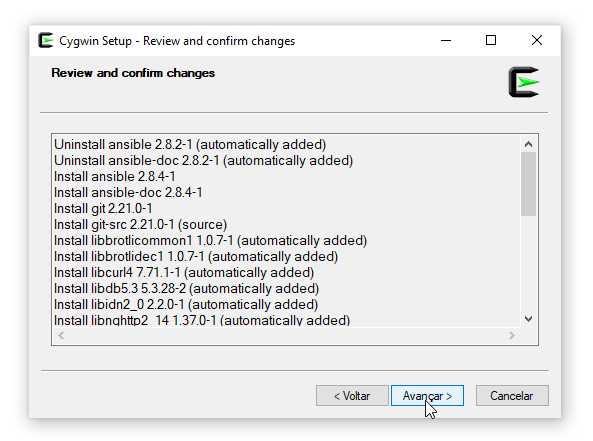

Aguarde o download dos pacotes:

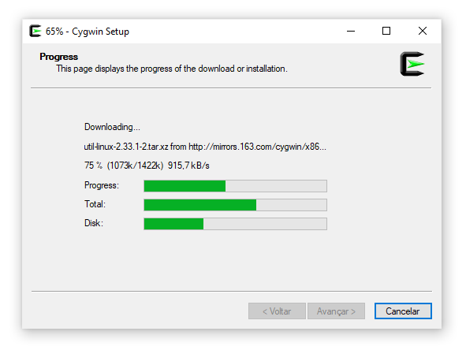

Para finalizar a instalação, marque as opções para criar ícone no Desktop e no menu Iniciar, e clique no botão **Concluir**:

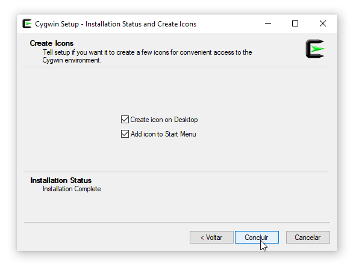

> Caso a instalação de algum pacote falhe, execute arquivo executável do Cygwin64 novamente, alterando a URL selecionada na opção **Available Download Sites** e execute as instalações novamente.

Para confirmar a instalação do **Git** no Windows, clique 2 vezes no ícone **Cygwin64 Terminal** e digite os seguintes comandos:

```bash
git --version
```
* Saída de Exemplo do Comando:

  ```text
  git version 2.21.0
  ```

### Sistema operacional Linux

Para instalar o **Git** na distribuição **Ubuntu e Debian**, execute os seguintes comandos:

```bash
sudo apt update
sudo apt install software-properties-common -y
sudo apt install git -y
```

Para instalar o **Git** na distribuição **Fedora**, execute o seguinte comando:

```bash
sudo dnf install git
```

Para instalar o **Git** na distribuição **CentOS**, execute o seguinte comando:

```bash
yum install git -y
```

Para confirmar a instalação do **Ansible** e do **Git** no Linux, execute os seguintes comandos:

```bash
git --version
```
* Saída de Exemplo do Comando:

  ```text
  git version 2.25.1
  ```

### Sistema operacional Mac OS X

Antes de iniciar a instalação do **Git** no Mac, vamos utilizar a ferramenta Homebrew [4]. Essa ferramenta funciona como um gerenciador de pacotes para o Mac OS X.

Para começar, acesse o terminal em seu Mac, e digite o comado para instalar o **Homebrew**:

```bash
/bin/bash -c "$(curl -fsSL https://raw.githubusercontent.com/Homebrew/install/master/install.sh)"
```

Para instalar o **Git** através do **Homebrew**, execute o seguinte comando:

```bash
brew install git
```

Para confirmar a instalação do **Git** no Mac OS X, execute os seguintes comandos:

```bash
git --version
```
* Saída de Exemplo do Comando:

  ```text
  git version 2.27.0
  ```

## Vagrant

O Vagrant [5] é um software de automação escrito em Ruby e mantida pela Hashicorp. Precisamos do **Vagrant** em nossa infraestrutura para automatizar a criação das máquinas virtuais do curso.

## Laboratório:  instalar o Vagrant


Neste laboratório vamos aprender como instalar o Vagrant nos sistemas operacionais Windows, Linux e Mac.

### Sistema operacional Windows

Para começar, acesse o site do Vagrant:

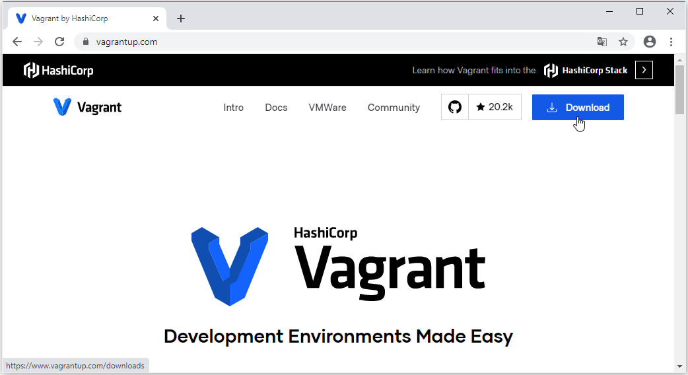

Em seguida, clique na opção **Download** para Windows:

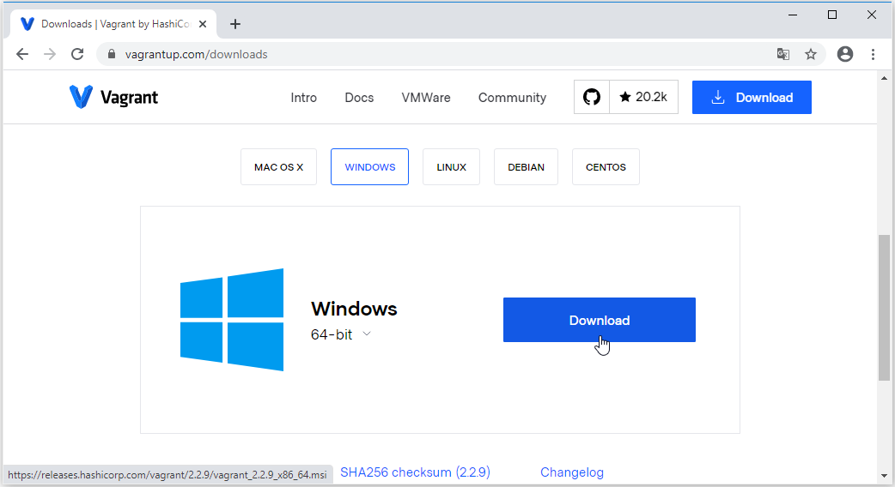

Clique duas vezes no arquivo executável do instalador e siga as instruções de instalação:

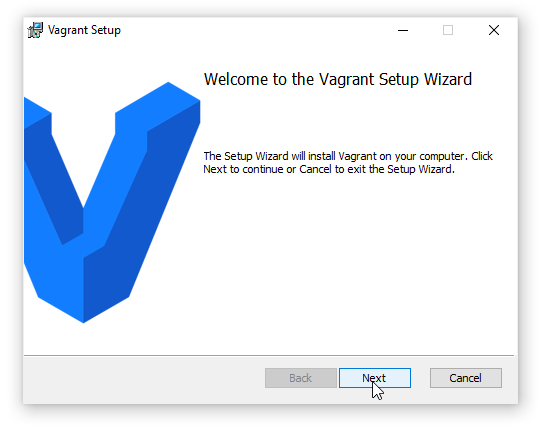

Após realizar a instalação, clique no botão **Finish**:

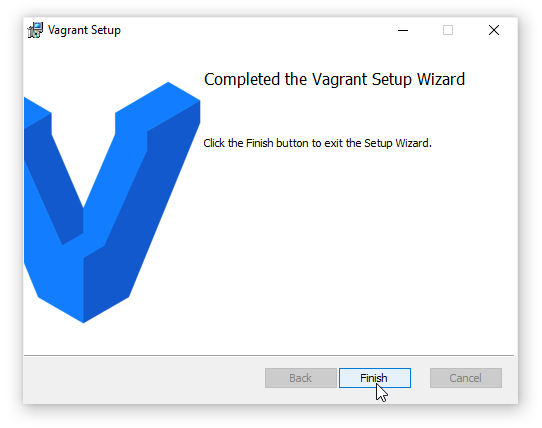

É preciso reiniciar o sistema para concluir a instalação do Vagrant:

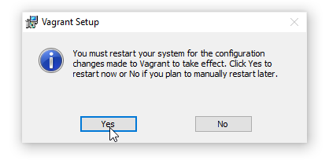

### Sistema operacional Linux

Para começar, acesse o site do Vagrant:

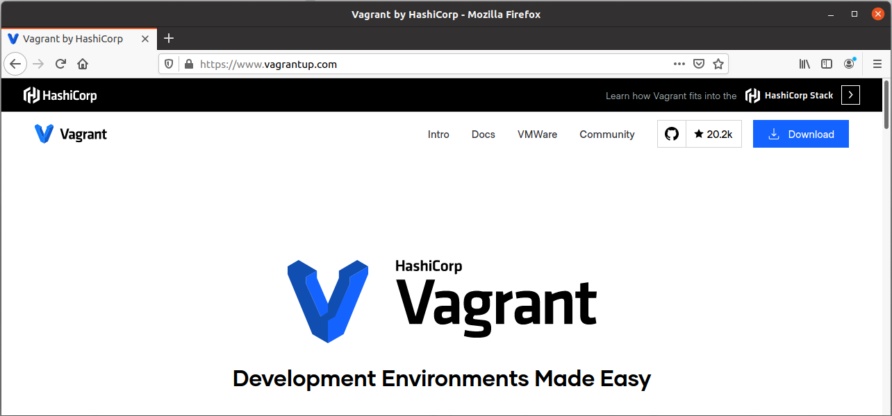

Em seguida, clique na opção **Download** conforme a sua distribuição:

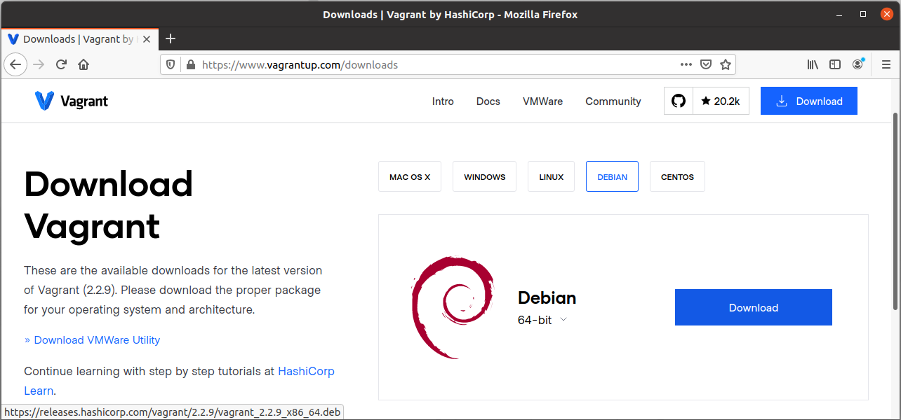

Selecione a opção para salvar o arquivo:

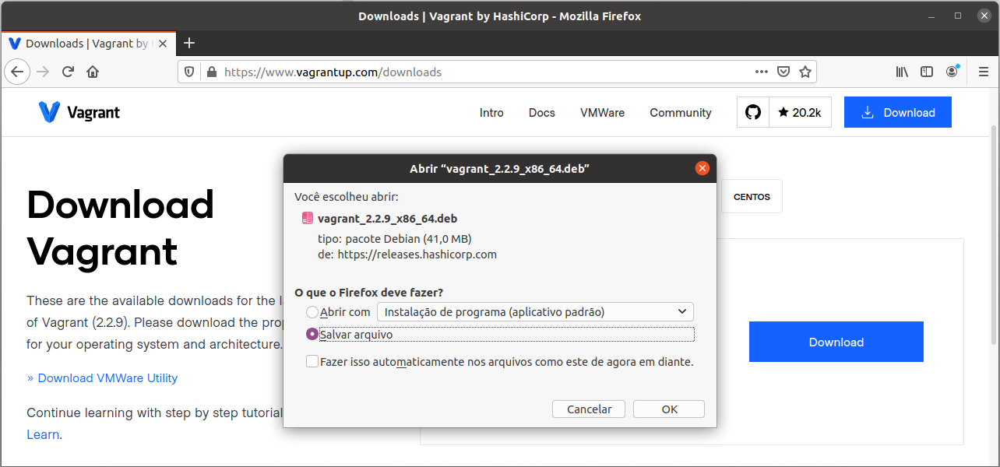

Acesse a pasta onde o pacote de instalação do Vagrant foi armazenado e realize a instalação conforme a sua distribuição. Exemplos:

**Debian/Ubuntu**:

```bash
sudo dpkg -i $HOME/Downloads/vagrant_<versão>.deb
sudo apt install -f
```

**CentOS**:

```bash
sudo rpm -i $HOME/Downloads/vagrant_<versão>.rpm
```

### Sistema operacional Mac OS X

Para começar, acesse o site do Vagrant:


Em seguida, clique na opção **Download** para MAC OS X:

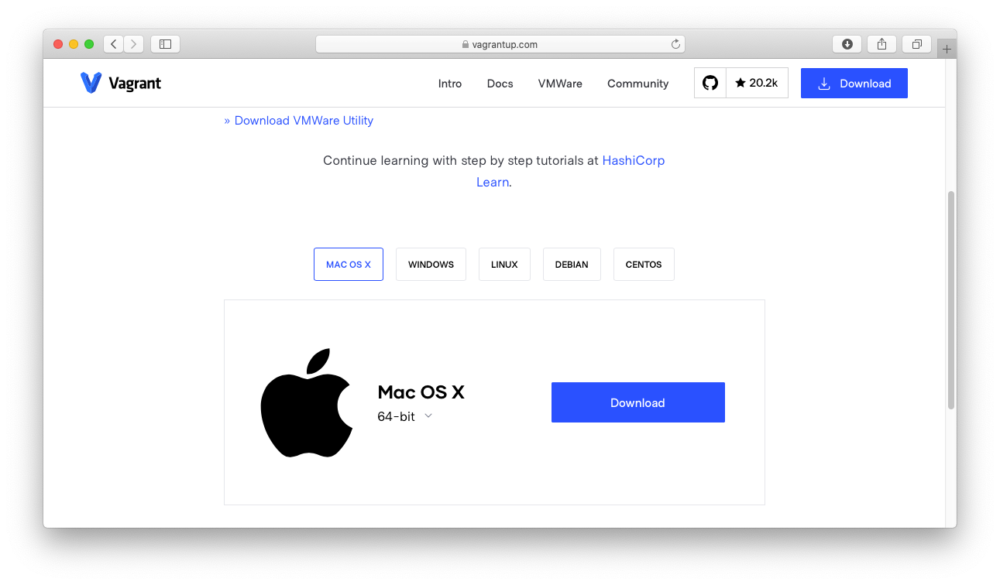

Clique duas vezes no arquivo **DMG** para montar o disco de instalação do Vagrant:

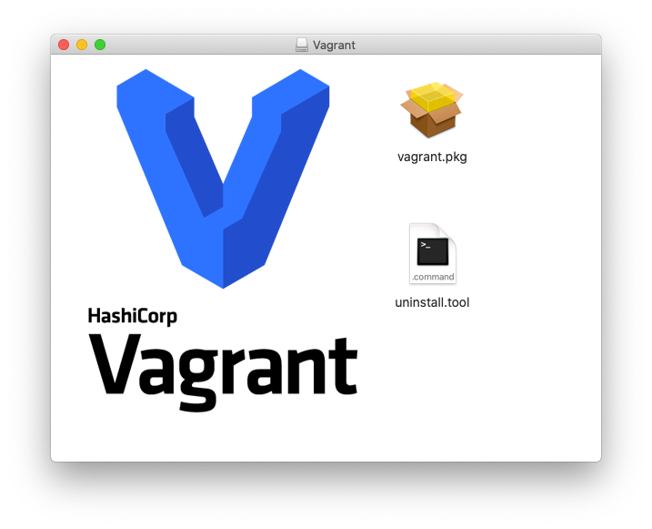

Feito isso, clique duas vezes no arquivo **vagrant.pkg** e siga as instruções de instalação:

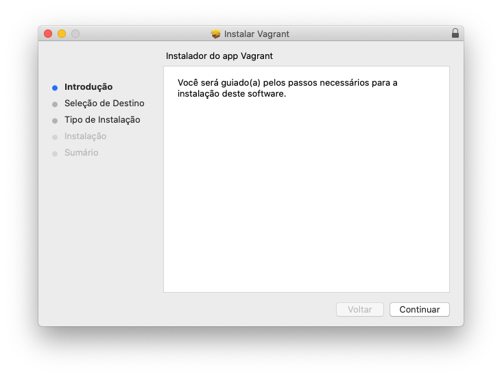

Após realizar a instalação clique no botão **Fechar**:

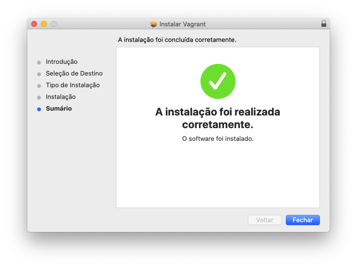

## Obtendo os arquivos deste material

Após instalar todas as ferramentas e preparar a sua infraestrutura, é preciso obter os arquivos que serão abordados durante os capítulos deste material, no Github da 4Linux [6]. Os arquivos são necessários para que seja possível instalar e configurar as máquinas virtuais através do Vagrant.

Abra um **Terminal** no Linux ou no Mac, ou então o **Cygwin64 Terminal** no Windows, e execute o comando **git** para clonar o repositório de seu curso. Depois de acessar o diretório criado, execute a criação do laboratório, conforme abaixo:

> **ATENÇÃO**: para máquinas com menos de 8GB de RAM recomendamos ligar duas máquinas virtuais por vez.


```bash
git clone https://github.com/joathamp/ataque_em_redes.git
cd ataque_em_redes/
vagrant up
```

O `vagrant up` é um comando utilizado para ligar as máquinas e, na primeira execução, provisioná-las. Conseguimos ligar uma máquina especifica com o comando `vagrant up {nome-da-maquina}` e se for necessário reexecutar o provisionamento, usamos o comando `vagrant provision {nome-da-maquina}`.

> **ATENÇÃO: o laboratório pode demorar para ficar completamente pronto.**

Após a finalização, teremos quatro máquinas virtuais disponíveis com as seguintes especificações:

Nome       | vCPUs | Memória RAM | IP            | Box
---------- |:-----:|:-----------:|:-------------:|:---------------------:
SD    | 1     | 3072MB      | 192.168.56.110 | joatham/Daryus_SD
MR | 1     | 3072MB      | 192.168.56.120 | joatham/Daryus_MR
XXXXX    | 1     | 4092MB      | 192.168.56.130 | XXXXXX
XXXX | 1     | 2048MB      | 192.168.56.140 | XXXXXX

Para deixar as máquinas desligadas enquanto não as utilizamos, é possível executar o seguinte comando:

```bash
vagrant halt #desligar todas as máquinas
vagrant halt {nome-da-maquina} #desligar uma máquina especifica

```

## Mais informações:

[1]: [VirtualBox](https://www.virtualbox.org)

[2]: [Git](https://git-scm.com/)

[3]: [CygWin](https://www.cygwin.com)

[4]: [Homebrew](https://brew.sh/index_pt-br)

[5]: [Vagrant](https://www.vagrantup.com)

Contato
----------------------

Entre em contato conosco.

Continue aprofundando seus conhecimentos, utilize este material para continuar praticando. 


Um forte abraco do Jota e do Vitor e de toda a equipe da Daryus, bons estudos e a gente se ve por ai:

* **Msc. Joatham Pedro**
  * **Perito Computacional**
  * **Pentester**
  * **Mestre em Sistemas e Computação** 
  * **Analista Sênior de Segurança da Informação - 4Linux** 
  * **Analista/Gerente de Seguranca - IFTO**   
  * **Instrutor MBA Cybersecurity Gov TI - FATEC Cuiabá**
  * **Instrutor  MBA Cybersecurity - IMPACTA**
  * **Instrutor Pos Graduacao Computação Forense - Daryus**
  * **Linux Professional Institute I** 
  * **Linux Professional Institute II** 
  * **Linux Professional Institute III - Security** 
  * **Datacenter Techical Specialist** 
  * **Novell Certified Linux Administrator (CLA)** 
  * **Computer Hacking Forensic Investigation - C|HFI** 
  * **Ec-Concil Incident Handler - EC|IH** 
  * **Certified Ethical Hacker - C|EH** 
  * **Exin Ethical Hacker - EXIN** 
  * **DevOps Essential Professional - DEPC** 
  * **Pos-Graduado em Redes de Computadores**
  * **Bacharel em Ciencia da Computacao**
  * **https://www.youtube.com/c/EaiQualteupapo**
  * **https://www.linkedin.com/in/joatham-pedro-44a3351b/**
  * **https://www.instagram.com/qualteupapo/**
  * **https://www.instagram.com/joatham.pedro/**
